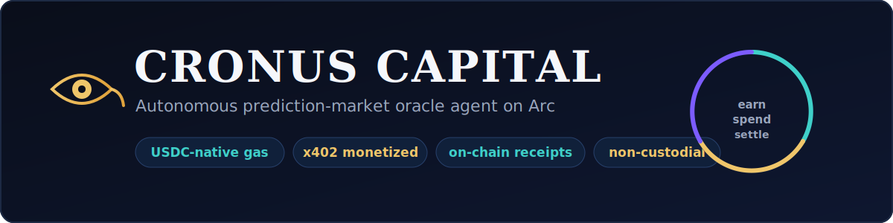

<p align="center">
  
</p>

<p align="center">
  <a href="https://github.com/Artem1981777/CronusCapital/actions/workflows/ci.yml"></a>
<a href="https://registry.modelcontextprotocol.io"></a>
</p>

# 𓂀 Cronus Capital

> **Ask Cronus: _"Should I buy BTC right now?"_** The agent scouts live market data, pays for it on-chain via x402, runs an EV check, and returns a verifiable **BUY / SKIP** verdict - every paid call settled in real USDC on Arc, with an on-chain receipt.

**The first AI agent that runs a real business on Arc — it earns, spends, settles, and reports its own P&L on-chain.**

> **Now with a NANO tier:** sub-cent ($0.001) paid calls settled **gas-free via Circle Gateway** (EIP-3009), consumed autonomously by an A2A buyer-agent — with honest self-demo labeling (no faked external demand).

Cronus is an autonomous prediction-market oracle agent. It scans markets, scores expected value with three oracles, and executes settlements in native USDC on Arc. Unlike agents that only *spend*, Cronus **charges for its work and closes the loop net-positive**, with a verifiable trace of every decision.

- **Live demo:** https://cronus-capital.vercel.app
- **Repo:** https://github.com/Artem1981777/CronusCapital
- **Use via MCP:** `npx cronus-mcp@latest` exposes Cronus as agent tools — free verdict + x402-paid signal + Circle Gateway nano.
- **Explorer:** https://testnet.arcscan.app
- **Network:** Arc Testnet · chainId 5042002 · native USDC 0x3600...0000 (6 decimals)

---

## Built for the Circle Gateway nanopayments round (Canteen × Circle · Arc)

This submission centers **Circle Gateway nanopayments**: a sub-cent ($0.001) agent-to-agent tier where an autonomous buyer-agent discovers, budgets, and pays **gas-free** (EIP-3009) for Cronus signals, with **honest, self-labeled traction** — no faked external demand. Details in [NANO nanopayments — Circle Gateway](#nano-nanopayments--circle-gateway-gas-free-sub-cent).

---

## Why it matters — RFB 02 (Monetize an API / agent)

Most "agent economy" demos show an agent *paying* for things. Cronus is the other half of the economy: an agent that **gets paid per call, covers its own costs, and earns a positive margin on every paid call** — fully on-chain and auditable.

> Other agents learn to honestly **spend**. Cronus is the agent that **earns**, pays, settles on-chain, and balances its P&L. It is an engine for the agent economy on Arc.

---

## Verify in 2 minutes (judges)

Every headline claim maps to a live endpoint or an on-chain transaction. Nothing here is mocked.

| Claim | Verify |
| --- | --- |
| Live product | https://cronus-capital.vercel.app |
| NANO $0.001 gas-free (Circle Gateway) | https://cronus-capital.vercel.app/api/nano-signal (HTTP 402 paywall) |
| Pay-per-second STREAM tier | https://cronus-capital.vercel.app/api/stream |
| Honest traction (self vs external) | https://cronus-capital.vercel.app/api/traction |
| External-payer leaderboard | https://cronus-capital.vercel.app/api/leaderboard |
| Public on-chain receipts | https://cronus-capital.vercel.app/api/receipts |
| Service manifest / OpenAPI | https://cronus-capital.vercel.app/api/manifest |
| Aggregate metrics | https://cronus-capital.vercel.app/api/metrics |
| Gateway settlement resolver (x402-exact 1:1 + batched footprint) | https://cronus-capital.vercel.app/api/settlements |
| EIP-712 spend-intents + KV replay-protection | https://cronus-capital.vercel.app/api/spend-intent |
| Verifiability scorecard (all claims + how to reproduce) | https://cronus-capital.vercel.app/api/scorecard |
| ERC-8004 Identity (agentId #1) | https://testnet.arcscan.app/address/0x252cAA46b9b0648908000f6C87e0a561DB4dEb6c |
| ERC-8004 Reputation (live count+avg) | https://testnet.arcscan.app/address/0x2A19ad056EaE83364B0a6420685974cA219c209E |
| ERC-8183 Escrow | https://testnet.arcscan.app/address/0x64e55De4CbC3CDf981B2c970807129FA61806873 |
| Stream micropayment feedback tx | https://testnet.arcscan.app/tx/0x44832c8718dd30cdf338966fc32584fc1c5509fb9afee63f6b9975b42c67bd34 |
| Pay Cronus yourself (NANO) | node scripts/buyer-agent.mjs --deposit 1 && node scripts/buyer-agent.mjs |

All `/api/*` endpoints return HTTP 200 (or 402 for the paywall) — never 500.

### Independently verifiable — not "trust me"

Every number on this page is reproducible by a judge with **zero private keys**. We publish a machine-readable scorecard that, for each claim, returns *how to verify it* — a command or an on-chain link — never a self-graded "passed":

- **Scorecard:** https://cronus-capital.vercel.app/api/scorecard — 4 Sourcify exact-match contracts, live on-chain counts, honest `external_payers: 0`, and the exact reproduce step for each claim.
- **No-key end-to-end:** `npm run verify-live` (51 checks) and `npm run verify-intent` (EIP-712 round-trip) reproduce the entire honesty surface against the live deployment without any secret.
- **Source, not bytecode:** every contract links to its verified, exact-match source on Sourcify.

We would rather show a verifiable **0** external payers than an impressive number you cannot independently check.

## Verify the Gateway integration in 2 minutes

The NANO tier is a real Circle Gateway integration (`@circle-fin/x402-batching`), not an on-chain-tx checker. Verify the actual gas-free flow:

1. **Gateway Wallet deposit (one-time, on-chain).** Buyer deposits USDC into the Gateway Wallet contract `0x0077777d7EBA4688BDeF3E311b846F25870A19B9`.
   Deposit tx: https://testnet.arcscan.app/tx/0xb817a39ce9a7b5e108831a356027c1e4ac24dabeafcc09ea1766cd8cef02fa7c
2. **402 + gas-free EIP-3009 authorization (off-chain, zero gas).** `GET /api/nano-signal` returns `402`; the buyer-agent signs an EIP-3009 authorization and retries — no gas, no on-chain tx per call.
   Reproduce: `node scripts/buyer-agent.mjs --deposit 1 && node scripts/buyer-agent.mjs`
3. **Verified & served immediately.** The seller middleware (`createGatewayMiddleware`) verifies the signature and returns the signal in the same response — it never waits for settlement. Response shows `payment.verification: "eip3009-signature"` and `served: "immediate"`.
4. **Batched settlement id.** Gateway settles net positions in batches and returns a settlement id (e.g. `2b381aa2-bb63-4f9c-b76a-663748c9f332`).
5. **Three billing models, one rail:** per-call `GET /api/nano-signal` ($0.001) · per-second stream ($0.00001/sec) · per-dataset `GET /api/nano-signal?tier=dataset` ($0.05).

### Arc testnet deviation (honest)

Per the sell-side quickstart, the EIP-3009 `validBefore` must be at least 7 days out. On Arc testnet, Circle Gateway returns **UUID settlement ids** and settles batches **1:1** (one authorization per settlement at current volume); these batched settlements are **not individually queryable on arcscan** like a normal transaction. We surface the real Gateway settlement id and label it honestly rather than fabricating an on-chain batch-tx link. The PREMIUM $0.02 tier (`/api/signal`) remains a standard on-chain x402 payment with a real arcscan tx.

**Settlement resolver (closes the mapping gap honestly).** `GET /api/settlements` resolves payments to settlements across both rails without inventing anything: the **`x402-exact`** rail lists direct USDC payer->treasury settlements **1:1** with real on-chain tx hashes and arcscan links, while the **`circle-gateway-batched`** rail reports the real on-chain footprint of the Gateway Wallet (settle + burn) and explicitly labels that a single nano-payment UUID does **not** map 1:1 to one on-chain tx (Gateway nets and settles in batches). Anything that cannot be mapped is returned as `null`/labeled — never a fabricated hash; per-transfer facilitator status is available when Circle API credentials are configured. Advertised in `/api/manifest` discovery and checked by `npm run verify-live` (section [7]).

## Traction (honest): paywall proven with self-generated volume

Cronus's premium signals are paid on-chain. To prove the paywall settles real USDC end-to-end, we drove the live deployment from **39 distinct self-test wallets** (all ours, across dev sessions) — not faked, but self-generated; no external customer has paid yet.

Snapshot (2026-06-29), straight from the Arc explorer:

- **39** distinct self-test wallets (all ours, used across dev sessions)
- **111** settled on-chain USDC payments (all self-generated test traffic)
- **2.22 USDC** total self-generated test volume
- **0** verified external (non-self) payers so far
- on a **testnet** these are wallets **we** controlled to exercise the paywall, so we do **not** present them as external demand; the honest external-payer count is **0** until a real third party pays.

Verify it yourself (always-current):

```bash
curl -s https://cronus-capital.vercel.app/api/leaderboard | jq '{external_payers, self_generated_wallets, self_generated_txs, self_generated_usdc}'
curl -s https://cronus-capital.vercel.app/api/traction   | jq '.self_generated'
node scripts/audit-funders.mjs   # re-checks every payer's first USDC funding source
```

The canonical metric is `external_payers`, which is **0** today (top-level in both `/api/traction` and `/api/leaderboard`): no verified third party has paid yet. The `self_generated_*` fields report our own on-chain test volume, labeled honestly and never counted as external. The nano-tier `unique_external_payers` reflects only the separate nano KV ledger and stays `0` until a nano-tier external payer appears, so it is not the headline number. Autonomous A2A demo volume is labeled `self_demo_calls` and never counted as external.

### Verified external demand (how `external_payers` is earned, not claimed)

`external_payers` is deliberately hard to inflate. A payer is counted **only if it is both (a) explicitly allow-listed** in `VERIFIED_EXTERNAL_PAYERS` **and (b) not one of our own wallets** (`selfAddresses()`), with its on-chain payment visible in `/api/receipts`. The allowlist is **empty by default, so the honest count stays `0`** until a real third party pays and is independently verified.

Why an explicit allowlist instead of "any wallet that isn't ours"? On a testnet, throwaway wallets can be faucet-funded to *look* independent, so "not-self" alone is not proof of external demand. A wallet is verified as independently funded (via `scripts/audit-funders.mjs` against `/api/receipts`) before it is added — no address is ever auto-promoted to "external".

Self-serve on-ramp for a real external agent/wallet:
- **One click:** the landing page mounts a **Pay Cronus** button — connect wallet, one real 0.02 USDC on-chain transfer, and you appear in the public settled-payments feed.
- **One command:** `CRONUS_URL=https://cronus-capital.vercel.app EXTERNAL_PRIVATE_KEY=0x... node scripts/pay-cronus.mjs` (use a wallet **you** funded; `DRY_RUN=1` shows the live 402 without paying).
- **Machine discovery:** `/api/manifest` carries `externalPayerHint`, so any agent can find the 402 flow + CLI on its own.

Once a payment lands and independence is verified, the address is added to `VERIFIED_EXTERNAL_PAYERS` and surfaces at the top of `/api/traction` (`external_payers`, `external_usdc`, `external_leaders[]` with arcscan tx links) and on the landing page. Self-generated test traffic is always labeled `self_generated_*` and never counted.

## Pay Cronus in 60 seconds (any funded wallet)

**No terminal? One click:** open the live dashboard, connect your wallet, and press **"Connect wallet & pay 0.02 USDC on Arc"** — one real on-chain transaction, and you appear in the public settled-payments feed. Need test USDC: https://faucet.circle.com (select Arc Testnet).

Two real, on-chain ways for an external agent/wallet to pay Cronus:

**NANO — $0.001, gas-free via Circle Gateway** (counts toward the external-payer leaderboard):

    export BUYER_PRIVATE_KEY=0x...            # any wallet with a little Arc testnet USDC
    node scripts/buyer-agent.mjs --deposit 1  # one-time Gateway deposit
    node scripts/buyer-agent.mjs              # pay $0.001 gas-free + consume signal
    node scripts/buyer-agent.mjs --stream --seconds 10   # pay-per-second nano stream

A wallet not in `SELF_DEMO_ADDRESSES` shows up as a real `unique_external_payer`:
- Leaderboard: https://cronus-capital.vercel.app/api/leaderboard
- Traction:    https://cronus-capital.vercel.app/api/traction

**PREMIUM — $0.02, on-chain x402:**

    export BUYER_PRIVATE_KEY=0x...            # any funded wallet (not the treasury)
    node scripts/pay-and-consult.mjs "BTC-USDC momentum"

Pays USDC from *your* wallet to the treasury and claims the signal with on-chain proof; verify the tx on arcscan.

> Honesty: self-funded demo traffic is always labeled `self_demo_calls` and excluded from `unique_external_payers`. We never fake external demand.

## The money loop (all real on-chain)

| Step | Action | On-chain |
|---|---|---|
| **Earn** | Client presses **UNLOCK SIGNAL · \$0.02 (x402)** | real USDC transfer to agent contract [0xd81a420…880f](https://testnet.arcscan.app/address/0xd81a420BFa4CE8778473BD46195B8E97e928880f) |
| **Pay** | Agent buys upstream data — **PAY UPSTREAM · \$0.005** | real USDC transfer out |
| **Net** | Net Flow = revenue − spend, shown live (green when > 0) | derived from booked tx |
| **Settle** | Decision written to the Verifiable Ledger (keccak hash-chain) | per-action label, Verified badge + tx link |

Demo frame: UNLOCK **+\$0.02** → PAY UPSTREAM **−\$0.005** → **Net Flow +\$0.015**, both with a "view tx" link on arcscan.

---

## Dashboard guide (what you are looking at)

The live demo (https://cronus-capital.vercel.app) is a single screen. Here is every panel, top to bottom.

**Header**
- **Title - CRONUS ORACLE DASHBOARD.** The agent's control room.
- **Wallet chip (top-right, e.g. `0xDC...7FBD`).** The connected wallet / agent treasury address. Click to connect or switch wallets.
- **Traction badge (`N x402 payments . X USDC settled on Arc . last tx`).** Live count of real on-chain x402 payments, read from `/api/metrics`; "last tx" links to the latest settlement on the Arc explorer.
- **Version badge (`v0.7.2 . MEMO + BATCHED PAYMENTS`).** Marks Arc transaction-memo support.

**Metric cards (top row) - all derived from real on-chain activity**
- **USDC SETTLED** - total USDC moved through the agent's verified settlements.
- **REVENUE (X402)** - income earned from paid signal calls.
- **PAID CALLS** - number of x402 paid calls served.
- **AGENT SPEND** - what the agent paid upstream for data.
- **NET FLOW** - revenue minus spend (green when positive); the agent's live margin.

**Metric cards (second row)**
- **DATA ROI** - USDC earned per 1 USDC of data spend (e.g. 1.6x); proves the loop is net-positive.
- **CONFIDENCE SCORE** - the agent's calibrated confidence (0-100) over its active signals.

**Agent pipeline (left) - the three oracles, with live status**
- **SCOUT - Signal Discovery.** Pulls live market data.
- **ANALYST - Risk & Conviction.** Scores expected value and conviction.
- **EXECUTOR - On-chain Settlement.** Signs and settles the USDC transaction.

**Market Intelligence (center)** - a live radar of the signals the Scout is tracking.

**Oracle Actions (right) - the buttons you press**
- **CONSULT ORACLES (free).** Runs the real LLM reasoning trace over live OKX data and prints the decision log plus a consensus verdict. No payment - start here to see how the agent thinks.
- **FORCE EXECUTE.** Manually triggers an on-chain settlement of the current decision (demo control).
- **BUY SIGNAL - 0.02 USDC (real x402).** The headline action: pays 0.02 USDC on-chain through Arc's Memo contract, verifies the payment server-side, then unlocks a verifiable signal - showing the verdict, conviction, a keccak `commitment`, the live **agent decision log** (`trace`), and a link to the payment tx. This is real money moving.
- **UNLOCK SIGNAL (demo) - 0.02 USDC (x402).** The same flow on a no-cost demo path for quick walkthroughs.
- **PAY UPSTREAM - 0.005 USDC (agent buys data).** The agent spends its own USDC on upstream data - the cost side of the loop.
- **DEPOSIT / WITHDRAW (bottom).** Move USDC in and out of the ERC-4626-style vault; your position and Vault TVL are shown below.
- Every paid action prints a **VIEW TX** link to the Arc explorer.

---

## How to use it (step-by-step for judges)

1. **Open the demo** - https://cronus-capital.vercel.app
2. **Connect your wallet** (top-right chip) and approve switching to **Arc Testnet** (chainId 5042002). Grab test USDC from the Circle faucet if needed.
3. **Press CONSULT ORACLES (free).** Watch the agent pull live BTC data and reason step by step (SCOUT -> DECOMPOSE -> DISCOVER -> DECIDE -> SUFFICIENCY -> EXECUTOR -> MEMORY -> CONSENSUS). It may return **SKIP** - it abstains when expected value is below its bar, by design.
4. **Press BUY SIGNAL - 0.02 USDC (real x402).** Confirm the transaction in your wallet. The agent verifies the on-chain payment, then unlocks the signal with its verdict, conviction, `commitment`, and live **agent decision log**. Click **VIEW TX** to see the real settlement (with a `Memo` event) on the Arc explorer.
5. **Press PAY UPSTREAM - 0.005 USDC** to see the cost side: the agent spends on data. Watch **NET FLOW** stay positive.
6. **Verify everything yourself:**
   - Public receipts: https://cronus-capital.vercel.app/api/receipts (add `?format=csv` to export)
   - Live metrics: https://cronus-capital.vercel.app/api/metrics
   - Machine discovery: https://cronus-capital.vercel.app/api/manifest and `/api/openapi`
   - Pay from outside the browser: `scripts/pay-and-consult.mjs` or `scripts/pay-with-memo.mjs`
7. **(Optional) Deposit into the vault** to see ERC-4626 share accounting, then withdraw.

The whole loop in one screen: **reason -> earn (x402) -> spend (upstream) -> settle -> report**, all real on Arc and all verifiable in a browser tab.

---

## How it works — 3 oracles

1. **Scout** — scans prediction markets, gathers signals.
2. **Analyst** — scores EV / conviction, calibrates against track record (Brier score).
3. **Executor** — settles on-chain (USDC transfer) with a pre-flight eth_call simulation and a keccak jobHash.

### Live reasoning trace (real LLM on real data)

Pressing **CONSULT ORACLES** calls the agent's own serverless endpoint `/api/consult`, which (1) pulls **real live market data** from the OKX public ticker (last price, 24h change %, 24h high/low, 24h volume) and (2) asks a **real LLM** (Groq, Llama 3.3 70B) to reason over those numbers and return a structured decision plus a **historical-analog recall**. The output streams into the dashboard line by line - there is no `setTimeout` script (open DevTools, Network tab, `/api/consult` to verify). Every figure in the trace is a fact we fed in or derived from it; the model is barred from inventing indicators (no RSI/EMA/SMA, no fabricated volume). A real run:

    SCOUT: 0.31% 24h change, price 63070.6
    DECOMPOSE: 24h range 62275.1-63359.9, current price 76.5% from low
    DISCOVER: distance to high 289.3, distance to low 795.5
    DECIDE: +0.31% 24h clears +0.20% trigger -> long bias, EV 0.58 vs 0.50 hurdle
    SUFFICIENCY: 24h volume 37.27, sufficient liquidity
    EXECUTOR: long entry 63070.6, stop 62275.1, target 63359.9
    MEMORY: nearest regime Bull -> continued upward (similarity 0.70)
    CONSENSUS: SKIP - conviction 58% (below 65 bar)

Note the verdict: **SKIP at 58% conviction**. Cronus abstains when its own confidence bar is not met - it is not a YES-machine. That discipline, plus the MEMORY analog stage, is what a pay-per-query data vendor (e.g. QMA) lacks: Cronus does not just sell a report - it reasons, decides, abstains, and runs the full on-chain economic loop.

---

## On-chain vault (ERC-4626-style)

A real vault on Arc Testnet: the user signs deposit/withdraw; yield (addYield) accrues into the share price (convertToAssets) — no faucet drip into balances.

- **Vault:** 0x13B6984357e27dAB17DF44a6396042239e70542C
- deposit / withdrawAll / addYield — all transactions visible on the address page.

---

## Verifiable & safe

- **Verifiable Ledger** — keccak256 hash-chain of decisions; **each action is labeled correctly** (x402 revenue / upstream spend / settlement / vault), with a Verified status.
- **Reasoning Trace** — content-commitment of the reasoning chain (keccak256), REPRODUCIBLE badge.
- **Track Record** — forecast history with hit-rate and Brier score.
- **SecOps** — per-tx cap 0.01, daily cap 5.0, recipient allowlist, pre-flight eth_call abort-on-revert.

---

## Standards & composability

| Standard | Role | Status |
|---|---|---|
| x402 | Pay-per-call (~\$0.02 / consult) | LIVE |
| CCTP | Native USDC, domain 7 | LIVE |
| ERC-4626 | On-chain vault, share accounting | LIVE |
| ERC-8004 | Identity Registry **LIVE on Arc** (`0x252cAA46b9b0648908000f6C87e0a561DB4dEb6c`, agentId #1); resolveByAddress reputation gate | ✅ LIVE |
| ERC-8183 | Job escrow (fund→submit→release/refund) **LIVE on Arc** (`0x64e55De4CbC3CDf981B2c970807129FA61806873`), gated by ERC-8004 identity | ✅ LIVE |
| ERC-8004 reputation | CronusReputation **LIVE on Arc** (`0x2A19ad056EaE83364B0a6420685974cA219c209E`); buyer-agent calls giveFeedback(agentId, score, jobRef) after each job; getReputation returns count + average | ✅ LIVE |

---

## Why Cronus is different

Most projects in this space ship **infrastructure** - a wallet, a policy engine, a lending pool, a prediction-market venue. Each is one piece of an agent economy. Cronus ships the thing that proves the infrastructure is worth building: **a complete, honest, self-sustaining business that already earns, spends, abstains, and settles on-chain - without ever holding your key.**

- **It runs the whole loop, not one primitive.** Earn via x402 -> spend on upstream data -> report net P&L -> compound into the vault. Most agents do one of these; Cronus does all of them, end to end.
- **Spend is non-custodial by construction.** Every *spend* settlement (the x402 buy path) is signed in your own wallet - the agent holds no key on the spend side. The autonomous *payout* path is the one bounded exception: a server-side treasury hot-wallet signs CCTP burns with minimal float, capped at 5 USDC per payout plus a daily circuit breaker (see the threat model). Spend caps, a recipient allowlist, and a pre-flight simulation are enforced on top. A guarantee built on a key the agent never holds is stronger than any policy engine.
- **Its reasoning is real and honest.** The CONSULT trace is produced live by a real LLM over real OKX market data, and the agent abstains (SKIP) when conviction is below its bar - no scripted animation, no fabricated indicators, no always-YES.
- **Everything is verifiable in a browser tab.** Live on-chain settlements, a keccak hash-chain ledger of decisions, and the pre-flight simulation are all open to inspection - no trust required.
- **Its reasoning is verifiable, not just visible.** Each consult runs deterministically (temperature 0 + a fixed seed), so identical inputs reproduce the same trace, and every run is content-addressed by the sha256 of its canonical input+output. Anyone can re-hash a stored trace via `/api/trace` and confirm it was not altered after the fact - honesty you can check, not just read.

**The thesis:** most builders are shipping *parts* of an agent economy. Cronus is a *working agent economy*, end to end, that you can audit yourself.

---

## Why Arc, not any other L1

Cronus is not "deployed on a testnet" - it depends on properties only Arc gives an autonomous economic agent:

| Arc property | Why Cronus needs exactly this |
|---|---|
| **USDC is the native gas token** | The agent earns, spends, and pays fees in one asset - no volatile gas token to hold or top up, and net P&L is denominated in the same dollar it transacts in. |
| **Sub-second finality** | Earn -> spend -> settle is a tight loop; a consult that resolves and a settlement that confirms in under a second are what make a live, in-browser demo of a full economic cycle possible. |
| **Built-in stablecoin / FX engine** | Upstream costs and payouts settle in stable value without bridging out, so the agent's books stay clean and auditable. |
| **x402-native payments** | Pay-per-call monetization (UNLOCK 0.02 / upstream 0.005) is a first-class primitive, not a bolted-on hack - the business model is the protocol itself. |
| **Opt-in privacy** | Strategy-level reasoning can stay private while settlements stay publicly verifiable - the agent proves it paid without leaking how it decides. |

Take away USDC-as-gas or native x402 and Cronus stops being a self-contained business. That is the difference between *deployed on Arc* and *only possible on Arc*.

---

## Unit economics & treasury solvency

Cronus is built to be self-sustaining, not subsidized. Each signal it sells through the x402 paywall earns more than the data it buys to produce that signal costs:

- **Revenue** — 0.02 USDC per paid call (x402, settled on-chain)
- **Data cost** — 0.005 USDC per upstream fetch (paid on-chain)
- **Data ROI** — revenue per $1 spent on data, shown live on the dashboard

The dashboard surfaces this in real time: Revenue (x402), Agent Spend, Net Flow, and Data ROI all update from the same on-chain activity. The agent only acts while the loop stays net-positive, capped per transaction and per day by its on-chain guardrails.

**Why this is sustainable, not a pyramid.** Margin is positive on *every external paid call* — 0.02 USDC in vs 0.005 USDC upstream cost, a ~4× markup. The treasury never depends on new investors or token buyers: there is no token, and no one is asked to "buy in" to fund payouts. Spend can never exceed revenue-bearing activity because every outflow is bounded by an on-chain per-transaction cap (0.01 USDC), a daily circuit breaker (5.00 USDC/day), and a conviction gate that only releases spend on positive-EV decisions.

**Honest scope.** Sustained profit requires real external demand for the agent's calls. On Arc testnet these figures are demo/modeled volume — they prove the *mechanism* is net-positive per call, not that the agent is already a profitable production business. The path to real solvency is more external x402 payers (and ecosystem grants such as the Arc Builders Fund), never raising money from new buyers to backfill the treasury.

## Mainnet funding model

Who funds the treasury in production, in order of priority:

1. **Paying customers (primary).** Other agents, trading systems, and apps pay per call over x402. At a ~4× gross margin per call (0.02 USDC in vs 0.005 USDC cost), revenue covers inference, data, infra, and gas at volume. The treasury grows from operations, not from new entrants.
2. **Runway capital (one-time).** Ecosystem grants such as the Arc Builders Fund, plus the founder's own USDC, cover gas and data before revenue scales. Gas on Arc is USDC-denominated and sub-cent, so bootstrap cost is small.
3. **LP vault (optional, capital-efficient).** LPs can deposit USDC as working capital and receive a share of the agent's *realized* on-chain profit — fully transparent and withdrawable. Returns are paid only from real P&L, never from new deposits.

There is no token sale and no "buy-in" to backfill the treasury. Sustained solvency depends on real external demand, which we do not fake; on testnet these volumes are modeled.

## Verifiable x402 paywall (anyone can pay Cronus)

Cronus exposes a real, on-chain-verified paywall at `GET /api/signal` — no demo bypass. Any external agent or wallet can pay and consume:

1. `GET /api/signal?topic=...` returns HTTP `402 Payment Required` with the price (0.02 USDC), asset, and `payTo` address.
2. The caller pays USDC on Arc, then retries with header `X-PAYMENT: <txHash>`.
3. The server verifies the payment **on-chain via JSON-RPC** (USDC transfer of the required amount to `payTo`, tx success, within a freshness window) and only then returns a signed signal plus a keccak256 `commitment` of the response.

**Proof — a self-test wallet we controlled paid and consumed (Arc testnet):**

- Payer (our self-test wallet): `0x46213abeca58cc9a89a269fd25a8737c700ca164`
- Payment: 0.02 USDC to `0xdc6778c5f8cc74b10aed11c48306d4cfc5737fbd`
- On-chain tx: https://testnet.arcscan.app/tx/0xfe2764b2b837365ea7cb896fbbe55119ffbf250e51941945bf013a88bb942086
- Response commitment: `0x993453223b57849b38df20ff050daa54905d53a3ac70c56c8e5460eb6fa77611`

This closes the loop honestly: the paywall verifies a **real on-chain USDC payment** server-side (here from our own self-test wallet) — it is still our own test wallet, not external demand. Reproduce with `scripts/pay-and-consult.mjs` (set `BUYER_PRIVATE_KEY` to any funded wallet).

> Replay protection: payments are accepted only within a freshness window (`SIGNAL_MAX_AGE_SECONDS`, default 1800s). Strict one-time-use can be added with a KV store.

**Two ways to consume the paywall:**

- **From any wallet or agent (CLI):** run `scripts/pay-and-consult.mjs` with a funded `BUYER_PRIVATE_KEY`. Exercised with our own self-test wallet (tx above).
- **From the dashboard (one click):** the **BUY SIGNAL** button runs the full x402 flow in-browser - request `402`, pay 0.02 USDC on Arc, verify on-chain, then render the verdict, the keccak `commitment`, and a link to the payment tx. No setup, no demo bypass.

**Agent discovery (machine-readable):** point any AI agent at the manifest or OpenAPI spec to auto-discover price, network, `payTo`, and the pay-then-retry flow:

- Service manifest: `GET /api/manifest`
- OpenAPI 3.0 / swagger.json: `GET /api/openapi`
- Every `402` response also embeds a `discovery` block linking both.

**Arc-native reconciliation (transaction memos):** payments can be sent through Arc's `Memo` contract (`0x5294E9927c3306DcBaDb03fe70b92e01cCede505`), which wraps the USDC transfer and emits an indexed `Memo` event while preserving the payer as `msg.sender`. This attaches a reconcilable reference (for example `cronus|signal|<topic>|<ts>`) to each payment on-chain - matching Arc's invoice/payout reconciliation use case - with zero change to our paywall, since the wrapped transfer still emits the USDC `Transfer` our verifier checks. Try it: `scripts/pay-with-memo.mjs "<topic>"`.

> Proof: tx `0xa7a0e3b25394d2c0570be62605f0a379b1a0e5d1ba2e7607f719fbd1ca9943d5` carried memoId `0x30c32e7e09b43cee3059b3d8136b591fda8c61d7840cff45911c60ee04e19d46` and unlocked a verified signal (commitment `0xc9acbd88b845a248e3ee669cca257f2e64f8c1daf17f64063d7765bfeae60680`).

## Live traction (real, on-chain, verifiable)

As of the latest build, the Cronus x402 paywall has settled **111 real USDC payments (~2.22 USDC) on Arc testnet** - every one a genuine on-chain transfer, verifiable in the explorer. The counter is **read live from the Arc block explorer** via `/api/metrics`, value-filtered to the exact 0.02 USDC signal price, so unrelated transfers (such as vault withdrawals) are never counted and the figure updates itself with each new payment.

**Honest scope:** this volume was self-generated against the live endpoint to prove the paywall handles real settlement at scale - it is **not external customer revenue**. Every payment is a real, auditable on-chain settlement; none of it is mocked or hardcoded.

- Live metrics: https://cronus-capital.vercel.app/api/metrics
- Public receipts: https://cronus-capital.vercel.app/api/receipts (add `?format=csv` to export)

## NANO nanopayments — Circle Gateway (gas-free, sub-cent)

### Popup-free session-key streaming (NANO A2A)

High-frequency agent-to-agent streaming can't ask for a wallet popup on every nano-payment. Cronus solves this with an **ephemeral session key**: fund once, then stream gas-free with no further prompts.

1. **Generate** — the browser creates a fresh session key via `viem`'s `generatePrivateKey()`, kept in memory only (never written to storage, never transmitted).
2. **Fund once** — the main wallet approves USDC and calls `GatewayWallet.depositFor(USDC, sessionKeyAddress, budget)` a single time, crediting the session key's Circle Gateway balance. This is the **only** on-chain action and the **only** wallet popup.
3. **Stream popup-free** — a `GatewayClient` built from the session key calls `.pay('/api/nano-signal?...')` about once per second. Each call is a real **EIP-3009** gasless authorization settled through Circle Gateway (default **0.001 USDC/s**) with a real Gateway settlement id. No wallet prompts after funding.
4. **Bounded by design** — the session key holds **no gas and nothing withdrawable** (only a Gateway spending balance it can authorize), and the client enforces a **hard budget**, a **per-transaction cap**, and a **session TTL**. Stop anytime; unused balance stays in Gateway.

**Trust model:** neither side ever holds the other's private key. The main wallet never exposes its key to the page, and the session key can only sign spend-authorizations up to the funded budget — it cannot move funds elsewhere. Every tick is a genuine Gateway payment; self-run demo traffic is labeled and **never** counted as external demand.

Try it on the [live demo](https://cronus-capital.vercel.app) (**FUND & STREAM**), or run it headless: `node scripts/buyer-agent.mjs --stream --seconds 30`.

Cronus also exposes a **NANO tier** at **$0.001/call**, settled **gas-free via Circle Gateway** (EIP-3009 signed authorizations, USDC on Arc). An autonomous **buyer-agent** (`scripts/buyer-agent.mjs`) discovers the service from `/api/manifest`, enforces a budget, pays gas-free, and consumes the signal — a full agent-to-agent (A2A) loop.

- **Live nano traction:** https://cronus-capital.vercel.app/api/traction
- **External-payer leaderboard:** https://cronus-capital.vercel.app/api/leaderboard

**Honest scope (the project's edge):**
- The buyer-agent is **self-funded**, so its address is registered in `SELF_DEMO_ADDRESSES` and counted as `self_demo_calls` — **never** as `unique_external_payers`. The on-chain x402 volume is **self-generated test traffic** (labeled `self_generated_*`); the nano-tier `unique_external_payers` stays `0` until a nano-tier third party pays.
- On Arc testnet, Circle Gateway settles **1:1** (each call gets its own settlement id). N→1 **batching is a Circle Gateway protocol capability at scale**, shown as such in the UI — not claimed as achieved here.
- Gateway settlement identifiers are labeled `gateway-batch` with on-chain tx **pending**; arcscan `/tx/` links render only for real `0x` on-chain hashes.

## Public on-chain receipts

**Arc-native receipts - no registry contract needed.** Every paid call emits an on-chain `Memo` event that doubles as a receipt. Browse all settled x402 payments at [`/api/receipts`](https://cronus-capital.vercel.app/api/receipts) (JSON) or export [`/api/receipts?format=csv`](https://cronus-capital.vercel.app/api/receipts?format=csv). Each receipt links txHash, payer, amount, block, commitment and memoId to the Arc explorer.

## What's real vs modeled (honesty)

- ✅ **Real on-chain:** every USDC transfer (x402 earn, upstream spend, vault deposit/withdraw, settlement), the hash-chain ledger, and the pre-flight simulation.
- ✅ **Real reasoning:** the CONSULT trace is produced live by a real LLM (Groq Llama 3.3) over real OKX market data (price, 24h change, 24h high/low, volume) via /api/consult - not a scripted animation - and the agent abstains (SKIP) when conviction is below its 65% bar.
- 🧠 **Historical analog = heuristic:** the MEMORY stage is the LLM's qualitative recall of a similar past regime with a similarity score - an estimate, not a backtested dataset.
- 🔐 **Non-custodial by design:** unlike autonomous agents that keep a hot private key on the server to self-sign, Cronus reasons autonomously but every settlement is signed in the user wallet - no agent key sits on the server, ever.
- ⚠️ **Modeled on testnet:** yield magnitudes and EV figures are illustrative — the mechanics, shares, and transactions themselves are real.
- ℹ️ **x402** here is a real USDC transfer to the agent (pay-per-call) — a real **HTTP 402** challenge: `/api/signal` returns 402 with payment requirements, the client pays USDC on-chain (pay-per-call), and the server verifies the on-chain tx before serving. Settlement is direct on Arc rather than via a separate third-party facilitator service.

---

## What's new (build log)
- **2026-07-02 — Pay-to-think COGS card on the landing (new):** ProofPanel now renders a live "Pays to think" card — settled COGS in USDC plus a link to the on-chain settlement tx on arcscan, honestly labeled self-operated demo (COGS, not external demand). Data is read from `/api/pay-to-think`. Purely additive; receipts=127, external_payers=0 unchanged. (`4a8da8c`)
- **2026-07-02 — Live pay-to-think settled on-chain + on the scorecard (new):** the deployed agent autonomously settled a real 0.02 USDC upstream-data payment on Arc testnet (tx `0xec90b3047a4fc489f0d1bd19d11231356405d480a1ec3061bd1656b1030b9f2a`), signed by the STAKE wallet (never the treasury payTo). `/api/scorecard` now carries a verifiable COGS claim linking to `/api/pay-to-think`, plus `live.cogs`. Honesty invariants unchanged: receipts=127, external_payers=0. (`ca06ecf`)
- **2026-07-02 — Live pay-to-think settlement (new):** new `/api/pay-to-think` — GET is a public COGS ledger (separate `cronus:cogs:*` namespace, so x402 receipts/traction honesty stays untouched); POST execute (Bearer `CRON_SECRET`) makes Cronus autonomously pay an upstream data provider in real USDC on Arc testnet, guarded by the shared daily spend-breaker + per-tx cap, signed with the STAKE wallet (never the treasury payTo). Upstream is a self-operated demo counterparty, honestly labeled COGS. Plus `scripts/pay-to-think.mjs` for a hands-on live burn. (`bd5d2ee`)
- **2026-07-02 — Pay-to-think wired into the live oracle (new):** `/api/consult` now records intended upstream data purchases as auditable cost-of-goods (COGS) INSIDE the content-addressed decision trace (re-verifiable at `/api/trace`) and returns an `economics` block (mode, settlement, decision, upstream_payments, cogs_atomic). Dry-run and dormant until `PAY_TO_THINK=1`; no funds move here. (`f0939ec`)
- **2026-07-02 — Pay-to-think data-market primitive (new):** Cronus can decide to PAY upstream x402 data providers when conviction is borderline, recording each purchase as auditable cost-of-goods (COGS) in the decision trace — making it a full economic actor (seller AND buyer). Pure, unit-tested, behind `PAY_TO_THINK` (dry-run by default; real settlement gated behind `PAY_TO_THINK_LIVE`). (`24724ae`)

- **2026-07-01 - Non-custodial co-sign hardened + tested (fix):** the ephemeral browser session-key streamer (`src/lib/session.ts`) already lets a user co-sign gas-free x402 nano-payments from an in-memory session-EOA the server never sees. Its money-safety limits (per-tx cap, total budget, session TTL, user stop) were inline and untested; extracted the exact gate into pure `src/lib/sessionGuard.ts` (`decideTick()`) and covered every stop-condition in `test/sessionGuard.test.mjs`, then wired `streamPay()` to the tested gate (behavior identical). New `docs/non-custodial-cosign.md` documents the design + threat model. (`0a8c5f7`)

- **2026-07-01 — Creator payout layer behind flag (new):** new `lib/creatorRegistry.js` (pure, zero-dependency, OFF by default behind `CREATOR_LAYER`) adds an allow-listed creator registry on top of the existing basis-point split engine without touching it: `resolveCreatorSplit()` validates that creator shares sum to 10000 bps and returns a deterministic allocation (last recipient absorbs rounding — no dust), and `assertAllowListed()` blocks paying any unlisted address. It only DECIDES a split — it never signs, burns, or moves funds — and stays completely inert unless explicitly enabled. Covered by `test/creatorRegistry.test.mjs`. (`3c44673`)

- **2026-07-01 — Forkable OSS primitives expanded (new):** `arc-primitives/` (MIT, zero-dependency) gains two standalone blocks: `spend-breaker.mjs` — a pure, deterministic spend-cap / circuit breaker so a hallucinated amount can never overspend (built-in `selftest` passes) — and `price-crosscheck.mjs` — corroborates a primary price against an independent Coinbase spot and reports spread + agreement (advisory, fail-open). Four forkable primitives now cover proving payment, paying with reconcilable context, capping spend, and cross-checking price. (`846095b`)

- **2026-07-01 — Honest on-chain track record (fix):** The landing ORACLE TRACK RECORD panel now renders live data from `/api/track-record` + `/api/backtest` instead of a hard-coded illustrative seed. It reports only real on-chain-resolved stakes — currently 1 resolved: a high-conviction (0.82) BTC call that was **wrong**, slashing 0.091 USDC to a burn address (realized P&L -0.091, Brier 0.6724) — with each row linking to its Arc resolve tx. Sparse but true: nothing is seeded, backfilled or cherry-picked. `vite build` green; deployed. (`f101b7b`)

- **2026-07-01 — MCP registry publish + `cronus_pay` tool & CLI (new):** `cronus-mcp` is now live in the **Model Context Protocol registry** (`io.github.Artem1981777/cronus-mcp`, published from `server.json` via a GitHub **OIDC** workflow) and on **npm** at v0.2.0 (`npx cronus-mcp@latest`). New **`cronus_pay`** tool returns the live x402 **HTTP 402 quote** for a premium signal plus the exact `pay_to`, network and `how_to_pay` steps, so any wallet or agent can settle USDC on Arc and retry `cronus_signal`; it **never moves funds and never fabricates payers** — a payment counts as a verified external payer only after on-chain confirmation (`/api/receipts`), and self-generated test traffic stays labeled separately. The package also gained a **CLI** (`cronus-mcp consult|signal|nano-signal|pay [INSTID]`) for one-shot JSON without an MCP client, and the landing become-an-external-payer CTA now points to `npx cronus-mcp pay ETH-USDC` (previously an internal self-demo script). Honest as ever: `external_payers` stays **0** until a real third party pays. Smoke (4 tools, consult 200 / signal 402) + CLI + `vite build` all green; published and deployed. (`aefa71e`)

- **2026-07-01 — MCP distribution: `cronus-mcp` package (new):** Cronus is now installable as MCP tools — `npx cronus-mcp@latest` exposes `cronus_consult` (free verdict + re-verifiable `traceHash`), `cronus_signal` (x402-paid, 0.02 USDC on Arc), and `cronus_nano_signal` (Circle Gateway nano). Registry-ready via `mcpName` + `server.json` (schema 2025-09-29). Thin proxy, no duplicated logic; verified with a live MCP handshake smoke test (consult 200, signal 402). (`6ecbc54`)

- **2026-07-01 — Proof panel: dashboard-visible backtest + live trace verification (new):** The live dashboard now carries a read-only **Proof** panel so anyone (judges included) can *see* the honesty machinery without reading code. It surfaces the signal **backtest** (`/api/backtest` — Brier, skill-vs-base-rate, resolved/open stakes) and the **content-addressed reasoning archive** (`/api/trace` — count + the latest `traceHash`), then **re-verifies that latest trace live**: it re-fetches `/api/trace?hash=<latest>`, the server re-hashes the stored record, and the panel shows a `VERIFIED` badge only when the recomputed address matches. Purely additive React (`src/components/ProofPanel.tsx`), fail-soft on fetch errors, mounted beside the settlements panel. Nothing is backfilled or simulated — the numbers score only Cronus's own on-chain-resolved stakes. `tsc` / `eslint` / `vite build` all green; deployed. (`28ac369`)

- **2026-07-01 — Unified daily circuit-breaker on the autonomous burn path (new):** The agent's cross-chain payout path (`/api/agent-payout`) now checks a **shared daily spend ceiling** before every burn — the *same* `cronus:spend:*` day-key used by `/api/spend-limit`, so claims, spend-limit spends, and cross-chain payouts all draw down **one unified daily budget**. If the store is reachable and the burn would exceed the ceiling, it logs a `hold` (`blockedBy:"daily-breaker"`) and **never burns**; if the store is unreachable it fails **open** to the existing per-payout cap (5 USDC). Every executed burn calls `recordDaily(amt)` to draw the shared budget down. This tightens the "safe autonomous agent" guarantees without touching the happy path: additive, behind `PAYOUT_DAILY_BREAKER` (default on), with `decideDaily` unit-tested. `tsc` / `eslint` / `node --test` (104) all green; deployed and verified live (81/0, no burn triggered). (`f258569`)

- **2026-07-01 — Deterministic reasoning + content-addressed trace archive with on-demand verify (new):** The oracle now runs **deterministically by default** — `temperature: 0` plus a fixed `seed` — so identical inputs reproduce the same reasoning trace (disable via `CONSULT_DETERMINISTIC=0`). Every `/api/consult` run is **content-addressed**: the canonical `{input, output}` is hashed with sha256 (`traceHash`) and archived, and the response now carries `reasoning { deterministic, model, seed, temperature }` + `traceHash`. A new public endpoint `GET /api/trace?hash=<hash>` returns the stored trace and **re-hashes it to re-verify its own address** — any tampering changes the hash (`verified:true` only when the recomputed address matches). The pure core (`lib/traceArchive.js`: `canonicalize` / `contentHash` / `buildTraceRecord` / `verifyRecord`) has 5 unit tests; KV I/O is fail-open. Routed through the existing `/api/info` dispatcher (no new serverless function). `forge` / `tsc` / `eslint` / `node --test` (104) all green; deployed and verified live — a live trace round-tripped `verified:true` (81/0). (`1e5d6c5`)

- **2026-07-01 — Second independent price source: OKX × Coinbase cross-check in the oracle (new):** `/api/consult` now corroborates its primary OKX price with an **independent Coinbase spot price** so a single-venue glitch or manipulation becomes visible. The response gains a `crossCheck` field — `{ source, altPrice, spreadPct, agree, tolerancePct }` — comparing the two venues within a configurable tolerance (default 1%). It is strictly additive and **never changes the verdict**; it is fail-open, so if the second source is unavailable, `agree` stays `null` and is never faked. Pure comparison logic (`lib/priceSources.js`) is covered by 6 unit tests using an injected fetch (no network). Default-on, disable via `CONSULT_XCHECK=0`. Live example: OKX vs Coinbase spread ~0.05%, `agree:true`. Full suite 99 green; deployed and verified live (81/0). (`c757e07`)

- **2026-07-01 — Signal backtest: Brier score + calibration over the agent's own on-chain-resolved stakes (new):** Added `/api/backtest`, which scores **only Cronus's own pre-committed stakes** from the same on-chain ledger as `/api/track-record` — `p` = the conviction committed on-chain *before* the outcome was known, `o` = the verifiable on-chain resolution (correct=1, wrong=0). It reports the Brier score `mean((p-o)^2)`, a base-rate skill score, and reliability-curve calibration bins. It never backfills or fabricates: with no resolved positions the Brier stays `null`, and only positions the resolver has settled on-chain are counted. The pure scoring core (`lib/backtest.js`) is covered by 5 unit tests and routed through the existing `/api/info` dispatcher (no new serverless function). `forge` / `tsc` / `eslint` / `node --test` all green; deployed and verified live (81/0). (`28b7620`)

- **2026-07-01 — Foundry test suite + CI for the 4 core contracts (new):** Added a self-contained Foundry suite — **25 tests across the Identity Registry, Reputation, Vault and Job Escrow contracts** — covering happy paths (id issuance, feedback aggregation, share math under yield, escrow create/submit/release/reject/refund) and every custom-error revert (duplicate / zero-address / unauthorized / bad-score / job-ref dedup / unregistered-provider / not-expired). No external dependencies: a vendored `contracts/test/Harness.sol` supplies a minimal cheatcode `Vm` interface + `MockERC20`, so `forge test` runs offline with no submodules or network. An isolated `foundry.toml` (`src=contracts`, `out=forge-out`) keeps the Solidity toolchain fully separate from the React `src/` and JS `lib/`. A dedicated `contracts` CI job now runs `forge build` + `forge test` on every push alongside the Node job. Local run: 25 passed, 0 failed. (`02b891c`)

- **2026-07-01 — Cross-chain USDC withdraw: Arc -> any supported EVM via Circle CCTP (new):** New `/api/agent-withdraw` lets the treasury move USDC off Arc to any of 7 supported EVM testnets (Sepolia, Base, Optimism, Arbitrum, Avalanche Fuji, Polygon Amoy, Unichain) by signing a real Circle **CCTP `depositForBurn`** on Arc — verifiable on arcscan. **Dry-run by default:** without `execute:true` the endpoint only validates and returns the exact burn plan (destination domain, padded `mintRecipient`, `maxFee`, atomic amount) and moves nothing. A real burn is bounded by a **per-payout cap** (`WITHDRAW_CAP_ATOMIC`, default 1 USDC) + the **shared daily breaker** + an **execution lock** + on-chain **`simulateContract`** before signing. **Stated honestly:** the burn is real and arcscan-verifiable, but the destination USDC mint completes only after Circle's CCTP attestation relay — it is labelled `pending_attestation` and no destination tx hash is ever fabricated. Pure arg-builder `lib/withdraw.js` is unit-tested (6 cases) with CCTP domains verified against the Gateway SDK; routed through `/api/info` so it adds **no new serverless function** (11/12). `node --check` + `eslint` + 88 tests + `verify-live` (81/0) green. (`e608fa7`)

- **2026-07-01 — Gateway settlements dashboard: 1:1 direct + N->1 batched footprint (new):** New read-only `GatewaySettlements` panel (behind `SHOW_SETTLEMENTS`) renders `/api/settlements` live, side-by-side: the **direct on-chain rail** (`x402-exact`, `1:1-onchain`, verifiable on arcscan — currently 7 settlements / $0.08) next to the **Circle Gateway batched footprint** (`net-batched` — real GatewayWallet burn+settle transfers, currently ~189 on-chain settle txs). The batching model is stated honestly: many gas-free EIP-3009 authorizations are netted by Circle Gateway and settled in batches (N->1) at scale, while on current Arc-testnet volume individual authorizations still settle 1:1. No hash is fabricated; per-transfer facilitator status is labelled as requiring Circle credentials and never invented. `tsc -b` + `vite build` + `eslint` + `verify-live` (81/0) green. (`b507d63`)

- **2026-07-01 — Unified daily spend breaker across all treasury outflows (new):** Extracted a shared `lib/breaker.js` and wired it into `/api/claim`, so every USDC that leaves the Cronus wallet — faucet claims, cross-chain payouts, and `/api/spend-limit` — now draws down ONE daily ceiling (KV-tracked `cronus:spend:day:*`, default 1 USDC/day, policy-adjustable) on top of each path's per-call hard cap. In production the breaker enforces *before* signing and returns `429` once the day's budget is spent; if the KV store is unreachable it fails back to the per-call cap so a demo claim can never exceed `MAX_CLAIM`. **Trust model, stated honestly:** the *payer side is fully non-custodial* — buyers and ephemeral session keys sign their own gas-free EIP-3009 authorizations and the server never holds a payer's key — while Cronus signs only for its *own* treasury, now bounded by a per-call cap + unified daily breaker + execution lock + on-chain `simulateContract`. We do **not** claim the treasury is keyless. The pure `decideDaily()` is unit-tested (5 cases). `node --check` + `eslint` + 82 tests + `verify-live` (81/0) green. (`5f44ff5`)

- **2026-07-01 — Consistent verified-external-demand across endpoints (fix):** `/api/leaderboard` no longer hard-codes `external_payers: 0`; it now derives `external_payers` / `external_txs` / `external_usdc` / `external_leaders` from the same allowlist-gated on-chain source as `/api/traction` (`verifiedExternal` over the `VERIFIED_EXTERNAL_PAYERS` allowlist, self-excluded). Both endpoints now return an identical, tamper-resistant count (honest `0` today) and their notes flip automatically the moment a real third-party payer is verified. `node --check` + `eslint` + 77 tests + `verify-live` (81/0) green. (`a46c88b`)

- **2026-07-01 — Popup-free session-key nano-streaming via Circle Gateway (new, hero):** Agent-to-agent pay-per-second streaming with **zero wallet popups after a single funding action**. The browser mints an **ephemeral session key** in memory (never persisted, never sent to any server); the main wallet approves USDC and calls `GatewayWallet.depositFor(USDC, sessionKey, budget)` **once** to credit the session key's Circle Gateway balance. From then on the session key signs **gas-free EIP-3009** nano-authorizations (default 0.001 USDC/s) against `/api/nano-signal` with **no further prompts**, returning real Circle Gateway settlement ids (on-chain / batched honestly labeled). Neither the browser nor the server ever holds the other's private key; the session key carries no gas and can only sign spend-authorizations up to a **hard budget**, with a **per-tx cap** and **session TTL** enforced client-side. New `src/lib/session.ts` + `StreamSession` landing panel (behind the `SHOW_STREAM` flag); `/api/*` and every existing rail untouched. `tsc` + `eslint` + `vite build` + `verify-intent` + `verify-live` (81/0) all green. (`2eed4e2`)

- **2026-07-01 — Verified external-demand path + honest `external_payers` allowlist (new):** `external_payers`/`external_usdc`/`external_leaders` are now derived from on-chain receipts that are BOTH in an explicit `VERIFIED_EXTERNAL_PAYERS` allowlist AND not self, so the count stays a truthful `0` by default and cannot be inflated by faucet-funded throwaways. Shipped a self-serve on-ramp: one-command CLI (`scripts/pay-cronus.mjs`, `DRY_RUN=1` 402 preview), a one-click **Pay Cronus** button on the landing page, `externalPayerHint` in `/api/manifest` for machine discovery, and a live "verified external demand" panel on the traction UI. Hardened `selfAddresses()` so the staking/agent-identity wallet is no longer mistaken for an external payer. Tests + `tsc` + `eslint` + `verify-live` all green. (`ad159fc`, `2ed7e5e`, `6d77855`, `0ef7fd3`)

- **2026-06-29 — EIP-712 signed spend-intents + KV replay-protection (new):** `GET /api/spend-intent` advertises the EIP-712 schema (domain chainId 5042002, `SpendIntent{payer,payTo,asset,maxAmount,nonce,deadline}`); `POST` recovers the signer with viem, enforces the deadline + binding (payTo=treasury, asset=Arc USDC), and burns the `(payer,nonce)` in Upstash KV (`SET NX`) so a replayed signed intent is rejected. Verification only — no funds move and no on-chain hash is fabricated. Reproduce: `npm run verify-intent` (ephemeral unfunded key, off-chain signature) and `npm run verify-live` (section [8], no keys).

- **2026-06-29 — Gateway settlement resolver (new):** `GET /api/settlements` maps payments to settlements across both rails honestly — `x402-exact` 1:1 with real arcscan tx hashes, `circle-gateway-batched` as the real Gateway-Wallet footprint with a labeled net-batched note; unmappable items are `null`/labeled, never fabricated. Advertised in `/api/manifest` discovery and checked by `npm run verify-live` (section [7]).

- **2026-06-29 — live Circle Gateway nano-payment (self-demo, honestly labeled):** the autonomous buyer-agent paid **0.001 USDC gas-free** via EIP-3009 through Circle Gateway. Gateway settlement id `aafeb3ee-056b-4f5a-bc7e-0c77ee808113` (batch; settles 1:1 on Arc testnet — see *Arc testnet deviation*). Signal consumed (verdict SKIP, conviction 58). On-chain ERC-8004 reputation feedback: [`0x87f2c4…cef72c`](https://testnet.arcscan.app/tx/0x87f2c43513371111566ee9a4267ee574cc970369a57ff226b669b215b3cef72c) — seller reputation now count=3, avg 5.00/5. Reproduce: `node scripts/buyer-agent.mjs --dry-run`.

Latest hardening, newest first:
- **Honest NANO traction + Circle Gateway A2A loop** — autonomous buyer-agent pays gas-free via Circle Gateway; self-funded traffic is labeled `self_demo_calls` and excluded from `unique_external_payers`; batching shown as a protocol capability (Arc testnet settles 1:1). (`e19b361`, `6c83b3d`, `4412f6f`, `1694dbd`)

- **Public on-chain receipts** - `/api/receipts` (JSON + CSV) lists every settled x402 payment with payer, amount, block, `commitment`, and `memoId`. (`46c6ada`)
- **Receipts in agent discovery** - the `402` challenge now advertises `/api/receipts` alongside the manifest and OpenAPI spec. (`d1e514c`)
- **BUY SIGNAL via Arc Memo** - the in-browser paid call routes through Arc's `Memo` contract, attaching a reconcilable on-chain reference; backend verification is unchanged. (`89cd5b9`)
- **Live traction badge** - the header badge reads real settlement counts from `/api/metrics`. (`997272d`)
- **Live metrics endpoint** - `/api/metrics` reports on-chain x402 traction (payments and USDC settled).
- **Live explorer-read traction** - `/api/metrics` and `/api/receipts` now read directly from the Arc block explorer (value-filtered to the 0.02 USDC x402 price), so the counts are self-updating and independently verifiable, not hardcoded. (`4d439b9`)
- **Visible agent decision log** - the reasoning `trace` (SCOUT ... EXECUTOR) renders live inside the BUY SIGNAL result. (`e81ce2c`)
- **Forkable OSS primitives (MIT)** - `arc-primitives/`: a zero-dependency x402 payment verifier (which independently confirmed our own memo payment) plus a pay-with-memo helper. (`8c2c28c`)
- **Security and honest trade-offs** - `docs/security-threat-model.md` lists verified properties and flagged limitations.
- **Honest traction** - `TRACTION.md` explains the self-vs-external methodology and gives a live, on-chain-verifiable snapshot (external_payers = 0).
- **Decision log** - `DECISIONS.md` records the key architecture and economic decisions with their trade-offs.
- **Known limitations** - `BUGS.md` tracks open issues and honest caveats.

---

## Run locally

    npm install
    npm run dev

Connect a wallet on Arc Testnet (chainId 5042002), grab test USDC from the Circle faucet, then try CONSULT → UNLOCK → PAY UPSTREAM → FORCE EXECUTE.

**No-key live verification (judges).** Reproduce every honesty claim end-to-end against the live deployment:

    npm run verify-live      # zero private keys: paywall, manifest, receipts/metrics, honesty invariants, on-chain confirmation, settlement resolver [7], spend-intent rejection [8]
    npm run verify-intent    # EIP-712 spend-intent round-trip (ephemeral, unfunded key): valid -> replay rejected -> tamper rejected

---

**Builder:** Artem Gromov · GitHub @Artem1981777 · ETH gromov7.eth

## Replay protection (verified live on Arc testnet)

- x402 payment proofs are bound to a 30-minute freshness window — stale proofs return `402 replay window closed`.
- Accepted proofs are one-time-use (Upstash KV, SET NX + TTL) — replaying a proof returns `402 payment proof already consumed`.
- Verified end-to-end: fresh paid proof `0x5b1d39b5...2290` -> first call `200`, replay -> `402 already consumed`.
- **Spend-intent nonce replay-protection.** Off-chain EIP-712 spend-intents (`/api/spend-intent`) reuse the same one-time-use guarantee: each `(payer, nonce)` is burned in Upstash KV (`SET NX` + TTL), so a replayed signed intent returns `valid:false — nonce already used`. Proven live by `npm run verify-intent`.

## Security deep-dive: the payment-replay attack we closed

**The threat.** In x402, a buyer proves payment by sending a transaction hash. But tx hashes are PUBLIC on the block explorer. With no extra protection, anyone could copy someone else's payment hash and replay it to get paid signals for free, unlimited times. One real payment would unlock infinite free access -- so the "monetization" would be fake.

**The fix (two layers).**
1. **Freshness window** -- proofs older than 30 min are rejected with `402 replay window closed`.
2. **One-time-use** -- every accepted proof is burned in Upstash KV (`SET NX` + TTL). Reusing it returns `402 payment proof already consumed`.

**Analogy.** A tx hash is a receipt. Before, the same receipt could be shown at the till forever. Now the till voids it on first use.

**Proven live on Arc testnet.**
- Fresh paid proof `0x5b1d39b5...2290`: first call `200`, identical replay `402 already consumed`.
- Stale proof: `402 replay window closed`.

**Why it matters here.** This track is about REAL API/agent monetization. Replay-able payments mean there is no monetization. Cronus enforces exactly one paid access per proof -- and proves it end-to-end on-chain.

## Stellar Integration: canonical USDC across Arc and Stellar (Circle CCTP)

Cronus moves canonical USDC between Arc (CCTP domain 26) and Stellar (domain 27)
using Circle Cross-Chain Transfer Protocol (CCTP V2) and the official Stellar
CctpForwarder. No wrapped assets and no custodial bridge: the same USDC is burned
on the source chain and minted on the destination chain. The Stellar relayer that
submits the mint pays only XLM fees and never custodies user funds.

### Verified end-to-end proof

First transfer (1 USDC, Arc to Stellar):

- Burn on Arc (depositForBurnWithHook): [0x8df2...faf172](https://testnet.arcscan.app/tx/0x8df20b0e4d3e46b7fd04336bec44080516d97ef5348b575823a3cd6ca9faf172)
- Mint on Stellar (mint_and_forward): [b9baf4...805d4](https://stellar.expert/explorer/testnet/tx/b9baf4efea289c49e12e09aa12c6c02d70b6613c2be80b3db7398385a76805d4)
- USDC trustline on the recipient account: [09cc62...96d3](https://stellar.expert/explorer/testnet/tx/09cc62cbf6493fbf2710cfdfeff07aaeddd1efb33844f343af9bb208e2f896d3)

Recipient account (USDC balance grew 0 to 2.0000 across two verified transfers):
[GBNJ2J...A2CAZK](https://stellar.expert/explorer/testnet/account/GBNJ2JNNLKQ53MO353PPOTNKI47DMHWVULKXMJMNLQWPF3FBIOA2CAZK)

The live demo renders a hero banner with both proof links and a Proof-of-Transfer
receipt under the Complete button: Arc burn, Circle attestation (domain 26 to 27),
Stellar mint, and the recipient USDC balance read live from Stellar Horizon.

### Flow

1. Burn (Arc). StellarBurn.tsx calls depositForBurnWithHook(amount, 27, forwarder, ARC_USDC, forwarder, maxFee, 2000, hookData) on the Arc TokenMessengerV2. The recipient Stellar G-address is encoded in hookData.
2. Attestation (Circle). Circle Iris observes the burn and produces a signed attestation for the CCTP message (amount, recipient, source and destination domain, nonce).
3. Complete (Stellar). api/complete-stellar.js (Vercel serverless) fetches the attestation, funds an ephemeral relayer via friendbot, and submits mint_and_forward(message, attestation) to the CctpForwarder on Soroban. Minted USDC is forwarded atomically to the recipient. No recipient signature needed.
4. Balance (Horizon). StellarWallet.tsx and the Proof-of-Transfer receipt read the live USDC balance from Stellar Horizon.

### Contracts and parameters

| Item | Value |
| --- | --- |
| Arc CCTP domain | 26 |
| Stellar CCTP domain | 27 |
| Arc TokenMessengerV2 | 0x8FE6B999Dc680CcFDD5Bf7EB0974218be2542DAA |
| Arc USDC | 0x3600000000000000000000000000000000000000 |
| Stellar CctpForwarder | CA66Q2WFBND6V4UEB7RD4SAXSVIWMD6RA4X3U32ELVFGXV5PJK4T4VSZ |
| Stellar USDC issuer | GBBD47IF6LWK7P7MDEVSCWR7DPUWV3NY3DTQEVFL4NAT4AQH3ZLLFLA5 |
| Soroban RPC | https://soroban-testnet.stellar.org |
| Circle Iris sandbox | https://iris-api-sandbox.circle.com |
| Stellar Horizon | https://horizon-testnet.stellar.org |
| Network passphrase | Test SDF Network ; September 2015 |

### Source files

- src/components/StellarBurn.tsx - burn and bridge on Arc
- src/components/StellarComplete.tsx - completion UI plus Proof-of-Transfer receipt (live Horizon balance)
- src/components/StellarWallet.tsx - link wallet, show USDC and XLM balance
- src/components/ProofBanner.tsx - hero banner with verified proof links
- src/components/StellarBridge.tsx - Iris attestation status
- api/complete-stellar.js - serverless mint_and_forward completer

## Autonomous payouts and security (Arc -> Stellar)

Built on top of the proven bridge+proof, two depth upgrades, both live in production.

### Autonomous payout agent

Files: `api/agent-payout.js` + `src/components/AgentPayout.tsx` (commit `c76cb3f`).

The agent evaluates available revenue against a policy and decides, on its own,
when and how much USDC to route to Stellar for creator payouts and remittances.

- Policy: share percent of revenue, minimum threshold, per-payout cap, enabled flag.
- Every decision is written to a keccak-chained decision ledger (prevHash -> hash)
  stored in Upstash KV, and shown in the "Recent agent decisions" panel.
- Verified on production:
  - available = 4   -> PAYOUT 1.2000 USDC (30 percent share)
  - available = 0.5 -> HOLD (below the 1 USDC threshold)
  - large values    -> capped at the 5.0000 USDC per-payout cap
- Execution reuses the proven CCTP burn path (depositForBurnWithHook -> mint_and_forward).

Endpoints (`api/agent-payout.js`):

- `GET ?action=status` returns policy, available, and the last decisions.
- `GET ?action=decide&available=<n>` runs the policy and appends a ledger entry.
- `GET ?action=set-policy&...` updates share / threshold / cap / recipient / enabled.
- `GET ?action=set-available&value=<n>` sets the tracked available revenue.

### Completer hardening

File: `api/complete-stellar.js` (commit `e2d5b74`).

- Trust model: the recipient is bound in hookData at burn time, so the
  permissionless completer cannot redirect funds. The relayer (ephemeral, or from
  RELAYER_SECRET) only holds XLM for fees, so there is nothing to steal.
- Graceful already_completed: re-submitting an already minted message returns a
  clean 200 instead of a raw revert.
- Idempotency + rate limit: per-message KV cache and per-IP limit (10 per minute).
- Timeouts: AbortController on every external fetch (Iris / Horizon / friendbot).

### Server-side autonomous execution (shipped)

The payout agent can now execute the cross-chain burn itself, signed by the treasury key on the server with no browser wallet in the loop. Endpoint: GET /api/agent-payout?action=execute (optional &available=N override). The agent reads policy, decides amount, ensures USDC allowance, and submits depositForBurnWithHook on Arc via CCTP V2. Read-only health check: /api/agent-payout?action=signer-info returns the signer address plus native, USDC and allowance balances.

Proven on Arc testnet (server-signed, Status Success, method depositForBurnWithHook, from treasury 0x6829860b7f61FA01E5bf3D194d9f780ACa5B6787):

- Burn 1: 0xecc9ce81e1adc64356390d3e394880cf2572c6103e31b7b01665662eb10f8d0e
- Burn 2: 0x0aa56d3aa20490b5f215b6c4749b59baeccd6e4167cc794f9107c333b9539e75

Each burn routes 1.2 USDC (30 percent of 4 USDC available, under the 5 USDC per-payout cap) to the Stellar recipient via the CCTP forwarder, and is appended to the keccak-chained ledger with executed:true and the Arc burn tx hash. The UI panel exposes a one-click "Agent executes on Arc (server-signed)" action and links every executed ledger row to the Arc explorer.

### Autonomous scheduling (no human in the loop)

An external scheduler (cron-job.org) pings the execute endpoint every 15 minutes, so the agent runs itself with no clicks and no browser open. Each scheduled invocation is authenticated with a shared CRON_SECRET and recorded in the ledger with trigger "cron", which distinguishes autonomous runs from manual ones.

Trigger (secret redacted): GET /api/agent-payout?action=execute&secret=REDACTED

On each tick the agent re-reads its policy, decides the amount (30 percent of available, min threshold 1 USDC, per-payout cap 5 USDC), and either holds (nothing to pay) or submits a server-signed CCTP burn on Arc. Payouts are fully autonomous: the treasury pays out on a schedule, by itself, only when the policy allows.

## Skin in the Game — Conviction Staking

Cronus doesn't just publish signals — it puts its own USDC behind them. Every stake is
opened on-chain, held in escrow, and settled verifiably against a price the agent commits
to *before* the outcome is known. No human override, no edits after the fact.

### Settlement rule
At a stake's `resolveBy` horizon, the resolver fetches the instrument's last price from
OKX and compares it to the `openPrice` committed at open time:
- `YES` is **correct** if `last > openPrice`; `NO` is **correct** if `last < openPrice`.
- **Correct** -> the staked USDC is returned to the staking wallet.
- **Wrong** -> the staked USDC is burned to `0x...dEaD`. Irreversible.

### Endpoints
| Route | Method | Purpose |
|---|---|---|
| `/api/open-stake` | POST (auth) | Open a conviction stake; escrow the principal; record commitment + ledger |
| `/api/resolve-stake` | GET / POST (auth) | GET = no-funds dry-run preview of due positions; POST = settle (return or burn) |
| `/api/track-record` | GET | Public scorecard: open / resolved / correct / wrong, accuracy, at-risk USDC |

### On-chain roles (Arc testnet, chain 5042002)
- **Staking / agent-identity wallet (ERC-8004):** `0x46213abeCa58Cc9a89A269fD25A8737C700Ca164`
- **Stake escrow:** `0xd6Cb6BfA4e922A30a244473ddb2fd3ABA39D5d4D`
- **Burn sink:** `0x000000000000000000000000000000000000dEaD`

### First live stake
- Market `BTC-USDC`, verdict **YES**, conviction `0.82`
- Committed `openPrice = 60147.1`, stake `0.091 USDC`
- `openTx` `0x60b3bcb223ecbca4e507c52d44be70416059c3a20d1ebe098722f3ae88cf1003`
- **Resolved 2026-06-30:** outcome **WRONG** (lastPrice 58613.7 vs openPrice 60147.1; BTC fell). Stake forfeited: 0.091 USDC burned to the dead address (provably unrecoverable).
- `resolveTx` 0xb8b8a6a31370b645800051e66af25804199b53b7c528a417b34b7014e955a255 ([arcscan](https://testnet.arcscan.app/tx/0xb8b8a6a31370b645800051e66af25804199b53b7c528a417b34b7014e955a255))

### Honesty
`/api/track-record` reports `accuracy` strictly from on-chain-resolved positions (first resolved 2026-06-30: 1 resolved, 0 correct, 1 wrong, accuracy 0.0, 0.091 USDC slashed, realized P&L -0.091) — we
never claim a hit rate we haven't earned on-chain. At-risk and external metrics reflect
real on-chain state only.

## Agentic Finance Stack on Arc

Cronus implements the full agentic-finance stack — identity, settlement, and programmable
workflow controls — and goes one step further with verifiable skin-in-the-game accountability.

| Layer | Capability | Status |
|---|---|---|
| **Identity** | ERC-8004 agent registration + on-chain reputation (Sourcify exact_match) | Live |
| **Settlement** | x402 paid endpoints + Circle Gateway; USDC as payment *and* gas | Live |
| **Workflow — Escrow** | Conditional escrow: stake returned on correct outcome, burned on wrong | Live |
| **Workflow — Spending limits** | Hard daily cap + per-recipient cap, enforced before any USDC leaves the wallet | Live |
| **Workflow — Subscriptions** | Plan-based call quotas with per-call metering | Live |
| **Workflow — Split payments** | Basis-point fan-out of one payment across counterparties | Live |
| **Accountability — Verifiable reasoning** | Deterministic consult (temperature 0 + fixed seed) content-addressed by sha256; any run re-verifiable via `/api/trace` | Live |

**Beyond "an agent with a wallet."** Most agentic-payment demos stop at a key that can spend.
Cronus adds *accountability*: it stakes its own USDC on each conviction call and settles the
outcome on-chain, so reputation is earned rather than asserted. See **Skin in the Game** above.


### Spending Limits (live)

Before any USDC leaves the agent wallet, every payout is checked against two hard caps: a **daily budget** and a **per-recipient cap**. Limits are enforced server-side against a KV-backed daily ledger, so the agent cannot exceed its budget across calls.

- `GET /api/spend-limit` — transparency: current policy, today's spend, remaining budget, recent payouts.
- `POST /api/spend-limit?action=check` — dry decision for a `{to, amountAtomic}` (no auth, no funds).
- `POST /api/spend-limit?action=set-policy` — update caps (auth).
- `POST /api/spend-limit?action=spend` — enforce caps, then execute the USDC transfer on-chain (auth).

Default caps: 1.000000 USDC / day, 0.250000 USDC / recipient.


### Split Payments (live)

A single payment can fan out to multiple counterparties by basis-point weights (summing to 10000), with allocations computed exactly (remainder to the last leg, no dust loss).

- `GET /api/split-pay` — transparency: current split config + recent runs.
- `POST /api/split-pay?action=preview` — no-funds allocation for `{amountAtomic, recipients?}`.
- `POST /api/split-pay?action=set-split` — set recipients `[{address, bps}]` (auth).
- `POST /api/split-pay?action=execute` — route a total across counterparties on-chain (auth).


### Subscriptions (live)

Recurring, metered access to the paid signal API. A subscriber holds a plan that grants a call quota for a fixed period; every access is metered against the quota. Payment settles via the existing x402 signal flow.

- `GET /api/subscription` — plans, plus `?subscriber=` status.
- `POST /api/subscription?action=status` — subscription status for `{subscriber}` (no auth).
- `POST /api/subscription?action=subscribe` — activate `{subscriber, planId}` (auth).
- `POST /api/subscription?action=access` — meter one call for `{subscriber}` (auth).

Plans: daily (0.5 USDC / 100 calls), weekly (2.5 USDC / 1000 calls), monthly (8 USDC / 5000 calls).

## Verify it yourself

Cronus runs live on Arc testnet — every claim here is independently checkable, no trust required.

Run `node scripts/verify-live.mjs` (no auth, no funds moved): it probes every public endpoint, confirms the x402 paywall returns 402, checks spending-limit and split-payment enforcement (dry runs), and confirms every money-moving action is auth-gated (401 without a token).

Live sources of truth: `GET /api/manifest` (capabilities + discovery), `GET /api/openapi` (machine-readable spec), `GET /api/track-record` (staked positions / skin in the game), `GET /api/receipts` (on-chain x402 receipts).

On-chain (Arc testnet): ERC-8004 identity registry 0x252cAA46b9b0648908000f6C87e0a561DB4dEb6c, ERC-8183 job escrow 0x64e55De4CbC3CDf981B2c970807129FA61806873, reputation registry 0x2A19ad056EaE83364B0a6420685974cA219c209E. Escrow funding tx 0x5895d020c42e6f0b0f162b833a2b566499b4495aeeebc327e6192ef4df9e0b4c. All contracts verified on Sourcify (exact match).
