# Dashboard V2 — visual tour

Annotated gallery of the live Cronus Capital dashboard: https://cronus-capital.vercel.app
One screenshot per left-sidebar section (11 total).

Honesty note: all x402 payment volume shown is self-generated test traffic — genuine external payers remain 0, and every panel that could imply traction says so explicitly. Skin-in-the-game stakes, COGS payments and vault NAV are real on-chain transactions/reads on Arc testnet (self-operated, testnet balances).

## 1. Overview
Positioning, market regime and the upfront honest disclaimer.
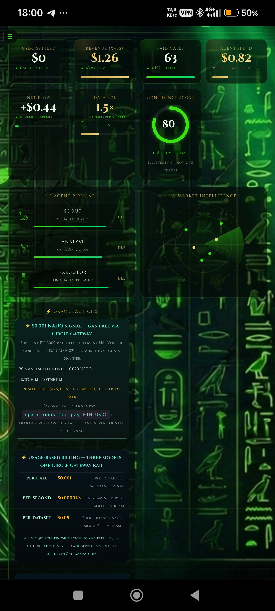

## 2. Oracle / Signals
Signals derived from live market data (BTC 24h/7d, Fear & Greed) — explicitly not a proprietary oracle.
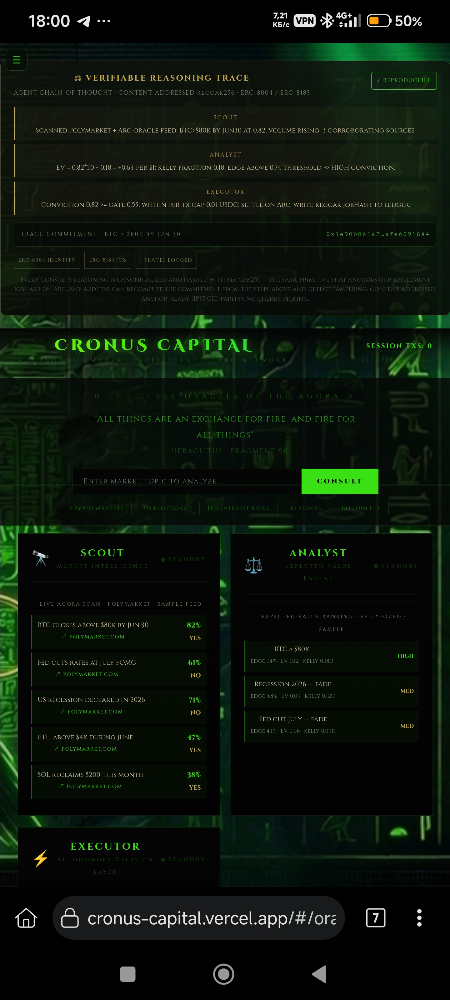

## 3. Markets / Intel
Live market data and tickers.
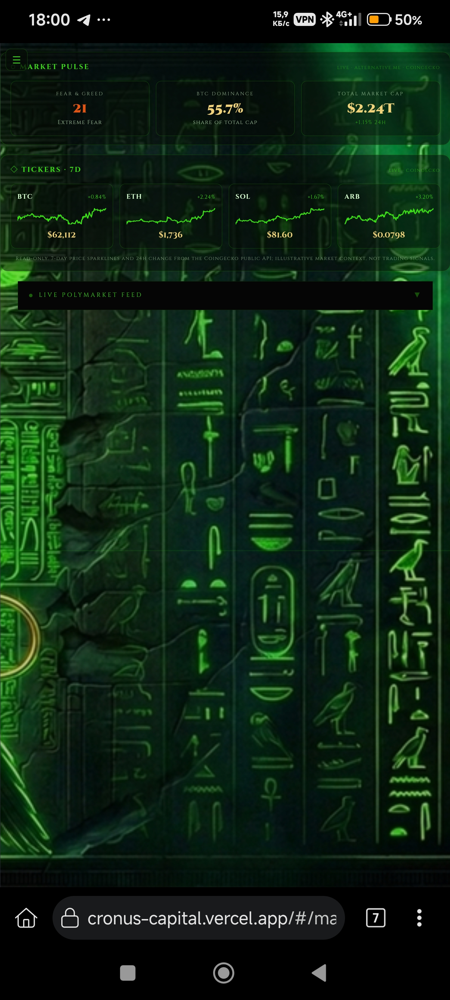

## 4. Payments (x402)
x402 settlement volume on Arc — self-generated test traffic; external payers remain 0.
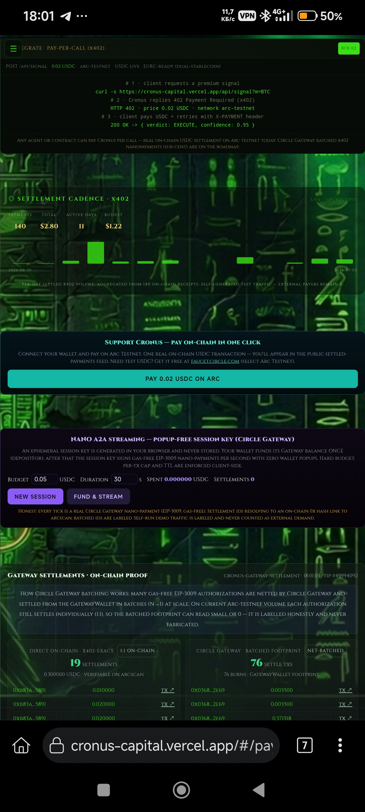

## 5. Traction
Traction over time, labelled as self-generated test traffic.
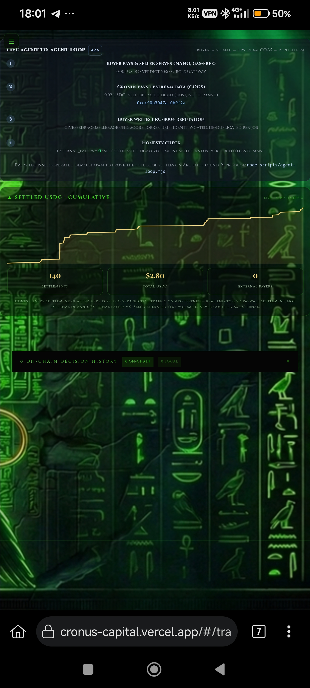

## 6. Vault
On-chain vault panel plus the VAULT NAV · LIVE curve (recorded from deploy onward, never backfilled).
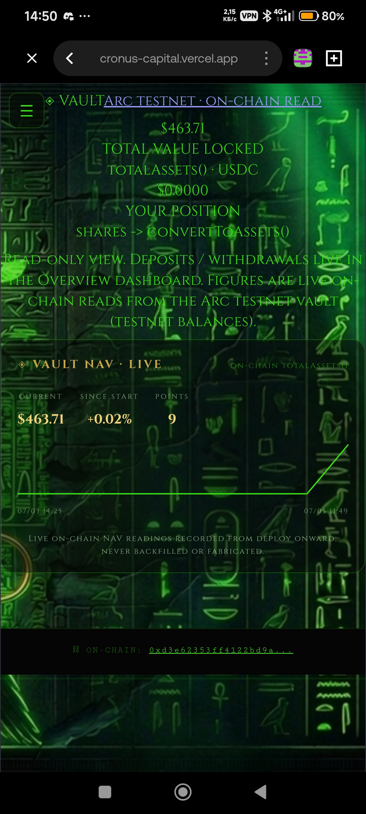

## 7. Track Record
Real on-chain skin-in-the-game positions, committed (keccak256) before the outcome is known.
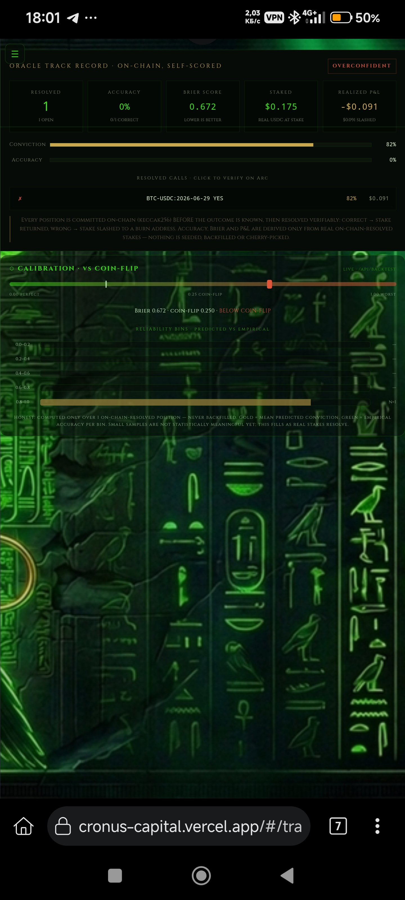

## 8. Proof / Verify
Proof seals and reproducibility of the on-chain evidence.
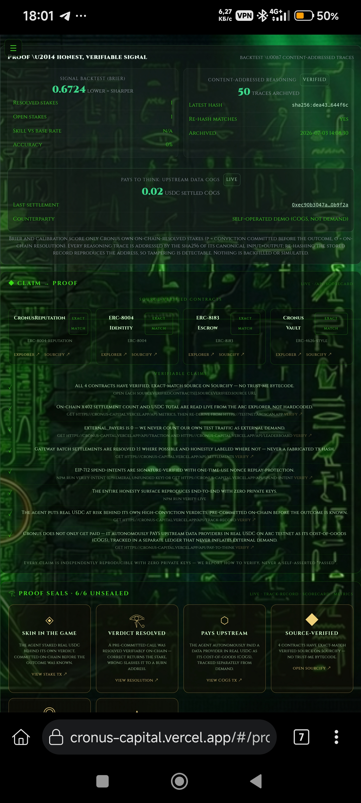

## 9. Standards
ERC-8004 identity/reputation and ERC-8183 escrow, verified on Arc.
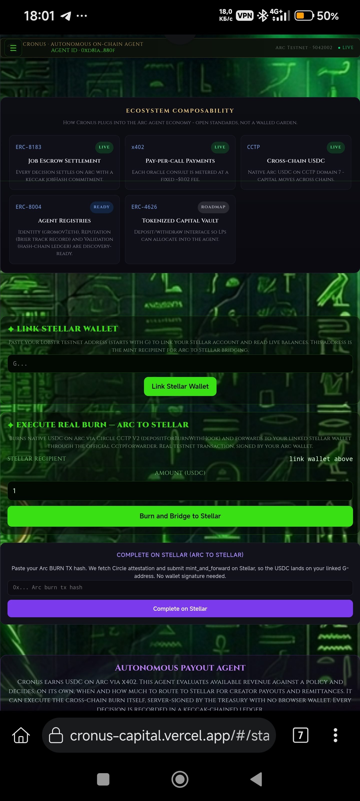

## 10. Risk / SecOps
Risk gauges and security operations.
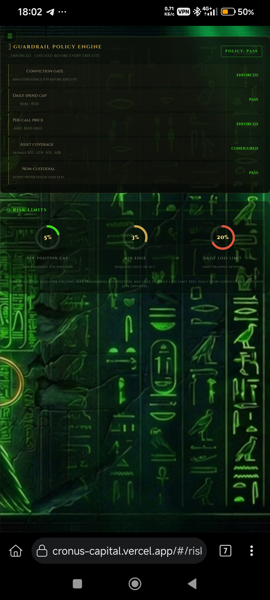

## 11. System
System status plus the audit / reproduce section.
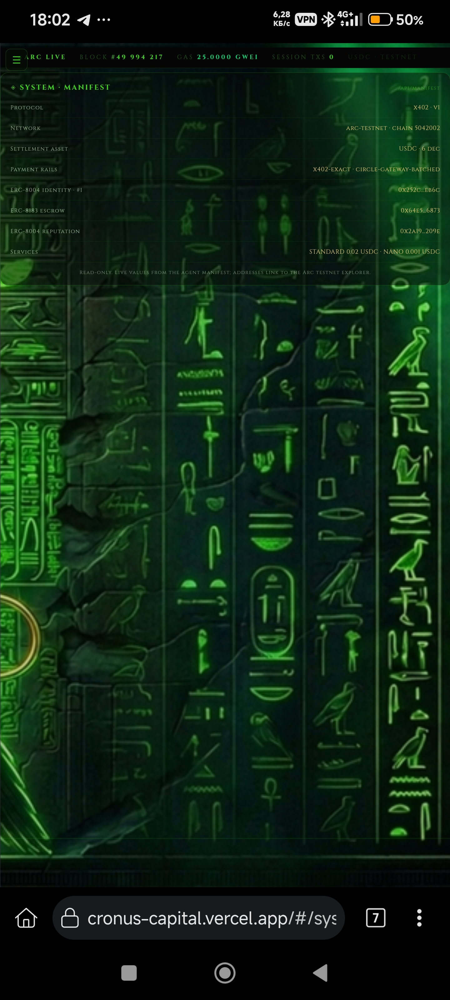
